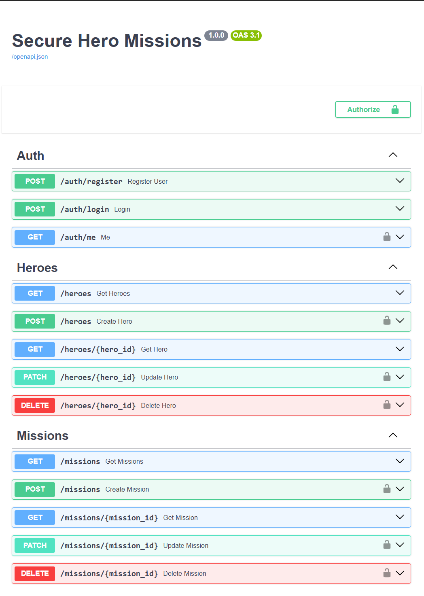
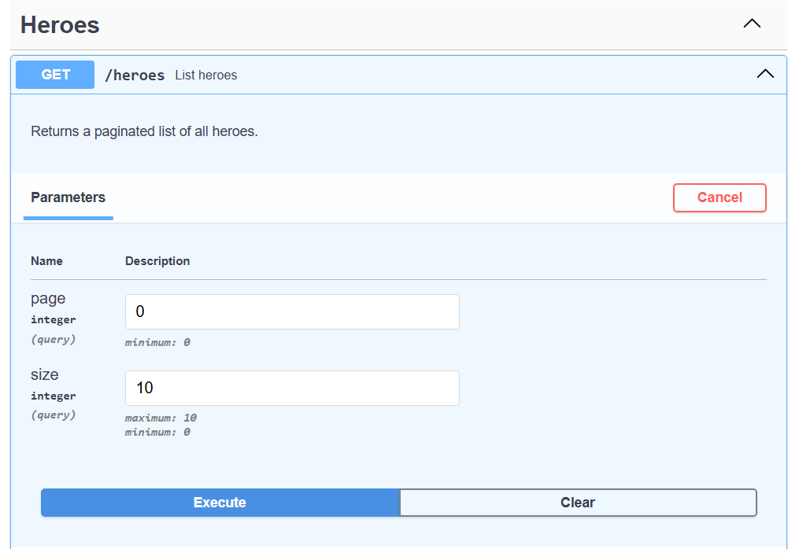
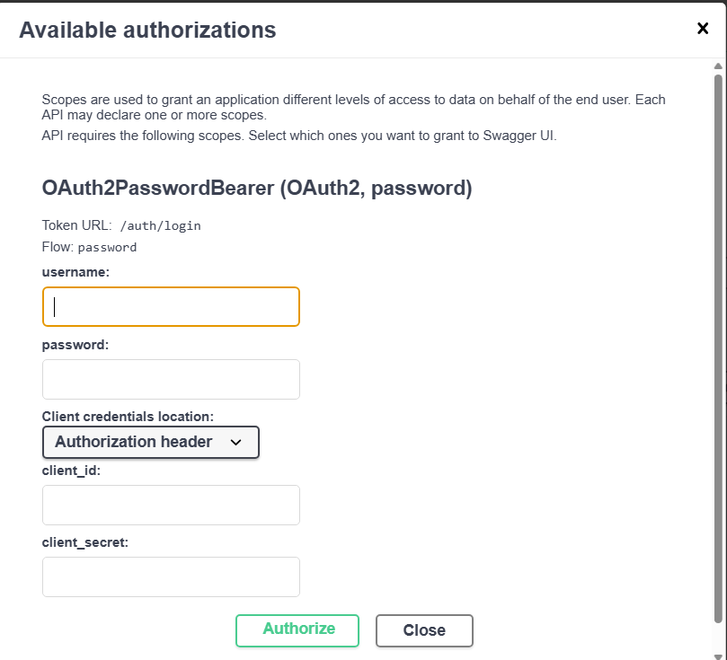
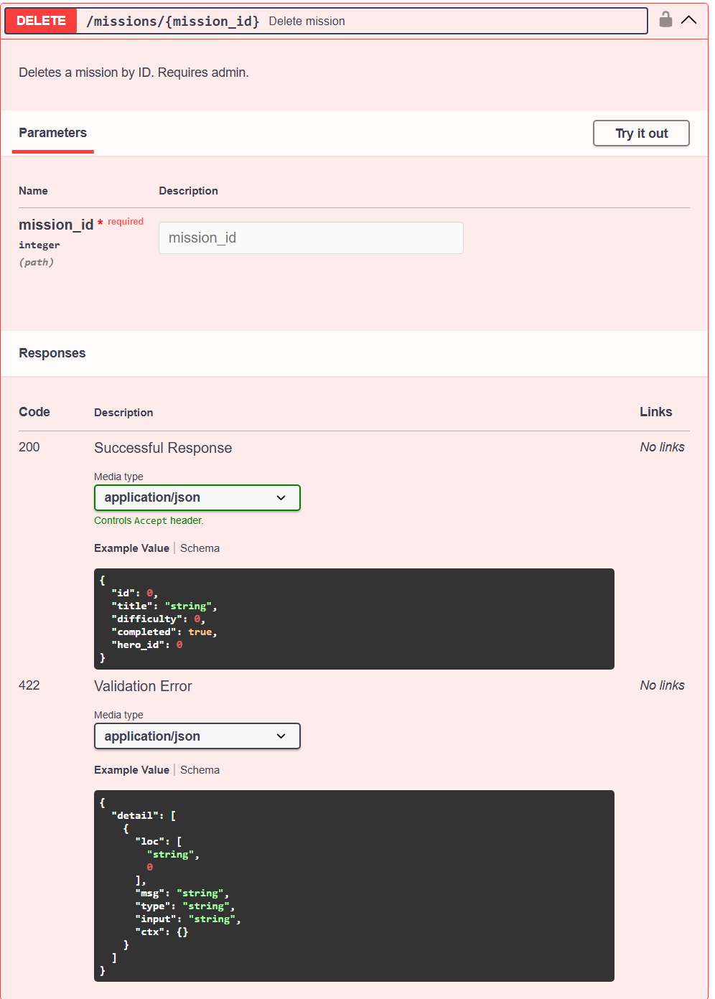

# Hero Missions API

A RESTful API for managing **heroes** and their **missions**, built with FastAPI, SQLModel, and JWT authentication.

---

## Table of Contents

1. [Project Overview](#1-project-overview)
2. [Project Structure](#2-project-structure)
3. [How to Run](#3-how-to-run)
4. [API Endpoints](#4-api-endpoints)
5. [Swagger UI](#5-swagger-ui)
6. [Strengths & Future Improvements](#6-strengths--future-improvements)

---

## 1. Project Overview

| | |
|---|---|
| **Framework** | FastAPI 0.136.1 |
| **ORM** | SQLModel (SQLAlchemy + Pydantic) |
| **Database** | SQLite |
| **Auth** | JWT Bearer tokens |
| **Testing** | pytest + in-memory SQLite |

Users can register, log in, and perform full CRUD operations on heroes and missions. Read endpoints are public; write endpoints require authentication; deletions are admin-only.

---

## 2. Project Structure

```
fast_api_project_hero_missions/
├── app/
│   ├── main.py              # App entry point
│   ├── models.py            # Database models & request/response schemas
│   ├── dependencies.py      # Auth dependencies
│   ├── security.py          # Password hashing & JWT
│   ├── db.py                # Database setup & session
│   └── routers/
│       ├── auth.py          # /auth
│       ├── heroes.py        # /heroes
│       └── missions.py      # /missions
│   └── tests/
│       ├── conftest.py      # Fixtures & test client
│       ├── test_auth.py
│       ├── test_heroes.py
│       └── test_missions.py
├── requirements.txt
└── README.md
```

---

## 3. How to Run

### Prerequisites

- Python 3.12+

```bash
pip install -r requirements.txt
```

### Start the development server

```bash
cd app
fastapi dev main.py
```

The API will be available at `http://127.0.0.1:8000`.

| URL | Description |
|-----|-------------|
| `http://127.0.0.1:8000/docs` | Swagger UI (interactive) |
| `http://127.0.0.1:8000/redoc` | ReDoc documentation |

### Run the tests

```bash
pytest        # all tests
pytest -v     # verbose
```

---

## 4. API Endpoints

### Authentication — `/auth`

| Method | Path | Auth | Description |
|--------|------|------|-------------|
| `POST` | `/auth/register` | — | Register a new user |
| `POST` | `/auth/login` | — | Log in and receive a JWT token |
| `GET` | `/auth/me` | Bearer token | Get the current user's profile |

---

### Heroes — `/heroes`

| Method | Path | Auth | Description |
|--------|------|------|-------------|
| `GET` | `/heroes` | — | List all heroes |
| `GET` | `/heroes/{hero_id}` | — | Get a single hero |
| `POST` | `/heroes` | Bearer token | Create a hero |
| `PATCH` | `/heroes/{hero_id}` | Bearer token | Partially update a hero |
| `DELETE` | `/heroes/{hero_id}` | Admin | Delete a hero |

**Fields:** `name`, `power`, `level` (1–100), `active`

---

### Missions — `/missions`

| Method | Path | Auth | Description |
|--------|------|------|-------------|
| `GET` | `/missions` | — | List all missions |
| `GET` | `/missions/{mission_id}` | — | Get a single mission |
| `POST` | `/missions` | Bearer token | Create a mission |
| `PATCH` | `/missions/{mission_id}` | Bearer token | Partially update a mission |
| `DELETE` | `/missions/{mission_id}` | Admin | Delete a mission |

**Fields:** `title`, `difficulty` (1–10), `completed`, `hero_id`

---

## 5. Swagger UI






---

## 6. Strengths & Future Improvements

### Strengths

- **Clean separation of concerns** — routers, models, dependencies, and security each live in their own module.
- **Input validation** — strict Pydantic schemas reject unknown fields and enforce constraints before any database interaction.
- **Role-based access control** — authentication logic is centralised in reusable dependencies, keeping route handlers clean.
- **Comprehensive test suite** — 27 tests covering happy paths and error cases, running against an isolated in-memory database.
- **Zero-setup database** — tables are created automatically on startup, no migration step needed.
- **Pagination** — list endpoints support `page` / `size` query parameters to handle large datasets efficiently.

### Future Improvements

- **Environment-based secrets** — the JWT secret key should move to an environment variable for production readiness.
- **Schema-Model Seperation** — as endpoints expaned `models.py` must be split into a schema folder and models folder
- **Password strength validation** — enforcing minimum length and complexity at registration would improve security.
